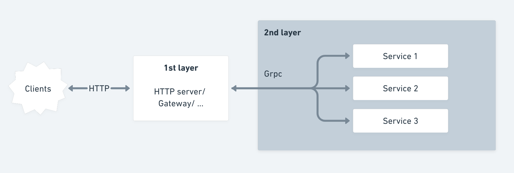
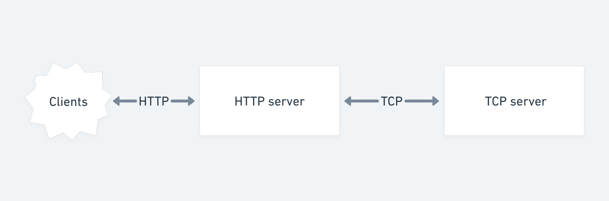

# TCP-server

## Background

A typical architecture is that users interact with the first server layer by using HTTP protocol. Behind the first layer, for better performance, servers typically talk to each other by using just TCP protocol (specifically some custom high-performance protocols on top of TCP)

## Main purpose

In real-world application, they typically usually use `grpc` for internal communication between services. 

However, for the purpose of exploring, in this repo, the author build a raw TCP server after the HTTP server with the aim to understand more of the following points:
- how TCP connection work
- how TCP parse message
- how to improve performance & robustness with connection pool
- how to code concurrency in Golang 

## Future work
- Use Lua script for performance